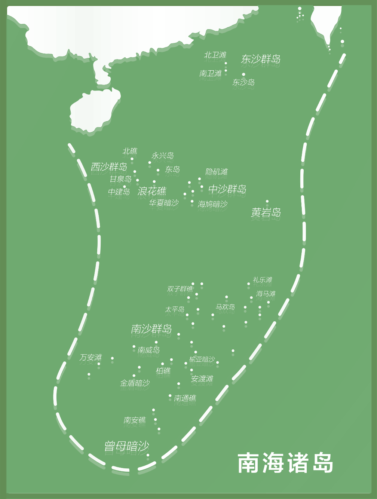

网页背景为白色，网页宽度为1550px
背景图片为底图.png，图片尺寸为（1426px,1178px），坐标为（0px,0px），不透明度为50%
,尺寸为（152px,200px）,坐标为（1346px,950px），不透明度为50%

各省市图片：
](安徽.png)尺寸为（134px,164px）,坐标为（1054px,630px）
](江苏.png)尺寸为（165px,128px）,坐标为（1088px,609px）
](山东.png)尺寸为（190px,119px）,坐标为（1049px,512px）
](浙江.png)尺寸为（107px,123px）,坐标为（1157px,736px）
](河南.png)尺寸为（163px,160px）,坐标为（931px,576px）
](河北.png)尺寸为（154px,220px）,坐标为（1001px,365px）
](天津.png)尺寸为（36px,50px）,坐标为（1080px,442px）
](北京.png)尺寸为（47px,50px）,坐标为（1045px,419px）
八张图片覆盖在背景图片上对应的区域，不透明度为100%，其他属性不变，包括亮度、对比度、饱和度等。
所有图片比例不变，完整展示，网页可上下滑动查看

各省市风光卡片如下：
安徽：.png>)，.png>)
江苏：.png>)，.png>)
山东：.png>)
浙江：.png>)，.png>)
河南：.png>)
河北：.png>)
天津：.png>)，.png>)，.png>)        
北京：.png>)，.png>)，.png>)

当鼠标悬停在地图上这八个省市对应的位置时，地图上对应的省市图片缩放+10%，亮度增加20%。
当鼠标悬停在地图上时，地图上对应的图片右侧出现该省市的名称，字体为FZLiuGQKSJW.TTF，字体大小为40px，字体颜色为#ffef77
当鼠标离开地图时，地图上对应的图片缩放-10%，亮度减少20%。
当鼠标离开地图时，对应的省市名称也消失。
当鼠标点击地图上对应的省市图片时，该省市的风光卡片会出现，横坐标为20px，纵坐标始终位于网页展示区域的中间，图片比例不变，高度调整为背景图片的45%。且同时只展示一张卡片，当同一省市有多张卡片时，先展示第一张卡片，点击卡片切换下一张卡片。
当鼠标再次点击地图上对应的省市图片时，该省市的风光卡片会消失。
当鼠标点击地图上对应其他的省市图片时，之前出现的风光卡片消失，该省市的风光卡片出现。